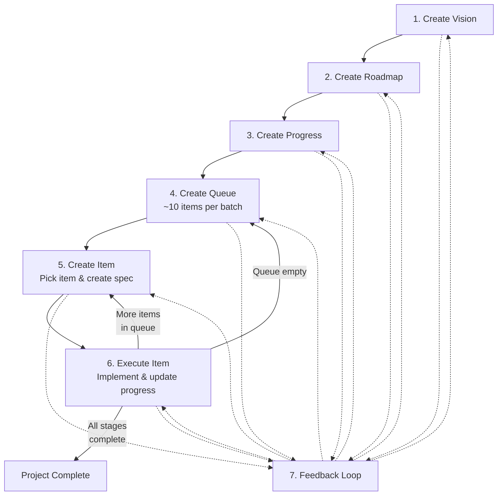

# AI-Driven Engineering (AIDE) Extension

A Spec Kit extension that provides a structured 7-step workflow for building new projects from scratch with AI assistants — from vision through implementation.

## Overview

AIDE implements the **AI-Driven Development Approach** as a set of Spec Kit commands. It guides you through a repeatable process that transforms an idea into a production-ready application:

1. **Vision** — Define the overall goal (`docs/aide/vision.md`)
2. **Roadmap** — Break down the vision into staged delivery (`docs/aide/roadmap.md`)
3. **Progress** — Track completion status (`docs/aide/progress.md`)
4. **Queue** — Generate next batch of prioritized work items (`docs/aide/queue/queue-NNN.md`)
5. **Work Item** — Create detailed specification from a queue item (`docs/aide/items/NNN-*.md`)
6. **Execute** — Implement the work item and update progress
7. **Feedback Loop** — Reflect, adjust, and improve the process (usable at any step)

**The work cycle:** Steps 1–3 once at start, then repeat 4–6 until done. Step 7 whenever you need to intervene.

## Installation

```bash
specify extension add aide
```

## Commands

| Command | Purpose |
|---------|---------|
| `/speckit.aide.create-vision` | Create a comprehensive vision document for a new project |
| `/speckit.aide.create-roadmap` | Generate a staged development roadmap from the vision |
| `/speckit.aide.create-progress` | Create a progress tracking file from the vision and roadmap |
| `/speckit.aide.create-queue` | Generate a prioritized queue of ~10 work items |
| `/speckit.aide.create-item` | Create a detailed work item specification from a queue item |
| `/speckit.aide.execute-item` | Implement a work item and update progress tracking |
| `/speckit.aide.feedback-loop` | Analyze issues and suggest process improvements |

## Usage

### Quick Start

```
1. /speckit.aide.create-vision "describe your project idea here"
2. [NEW CHAT] /speckit.aide.create-roadmap
3. [NEW CHAT] /speckit.aide.create-progress
4. [NEW CHAT] /speckit.aide.create-queue
5. [NEW CHAT] /speckit.aide.create-item        (auto-picks next item, or pass a number)
6. [NEW CHAT] /speckit.aide.execute-item        (auto-picks next item, or pass a number)
7. Repeat steps 5-6 until queue is empty, then repeat from step 4
```

> **Tip:** Start a fresh chat session for each step. This keeps the AI focused on the specific task at hand.

### Example

```
/speckit.aide.create-vision "a web-hosted platform for personal health tracking
with public blog content and private health metrics, meal planning, and recipes.
Multi-user with preference-based personalization. Built with .NET Core on Linux,
PostgreSQL, hosted on Azure App Service."
```

### The Change Cycle

When the feedback loop updates vision, roadmap, or progress, those changes cascade into the next queue. The queue command reads directly from these documents, so any update is automatically reflected the next time you generate a queue.

## Project Structure

The workflow creates and maintains these living documents:

```
your-project/
├── docs/
│   └── aide/
│       ├── vision.md            # Product vision and scope
│       ├── roadmap.md           # Staged development plan
│       ├── progress.md          # Feature tracking (📋 → 🚧 → ✅)
│       ├── queue/
│       │   ├── queue-001.md     # Prioritized work items (batch 1)
│       │   └── queue-002.md     # Next batch
│       └── items/
│           ├── 001-feature.md   # Detailed work item specs
│           └── 002-bugfix.md
```

**Status icons:** 📋 Planned · 🚧 In Progress · ✅ Complete · ⏸️ Deferred · ❌ Excluded

## Workflow Diagram



## Key Principles

- **One Project = One Vision + One Roadmap + One Progress** — these are living documents that are updated, never recreated
- **Changes cascade into the next queue** — updated documents are automatically reflected in the next queue generation
- **Queues are sequential batches** — each queue holds ~10 items; when exhausted, generate the next one
- **Each step is independent** — use fresh chat sessions to keep the AI focused
- **The feedback loop is always available** — use it at any step when you need to intervene
- **Trust but verify** — review AI outputs, run tests, commit incrementally

## Requirements

- Spec Kit >= 0.2.0

## License

MIT
