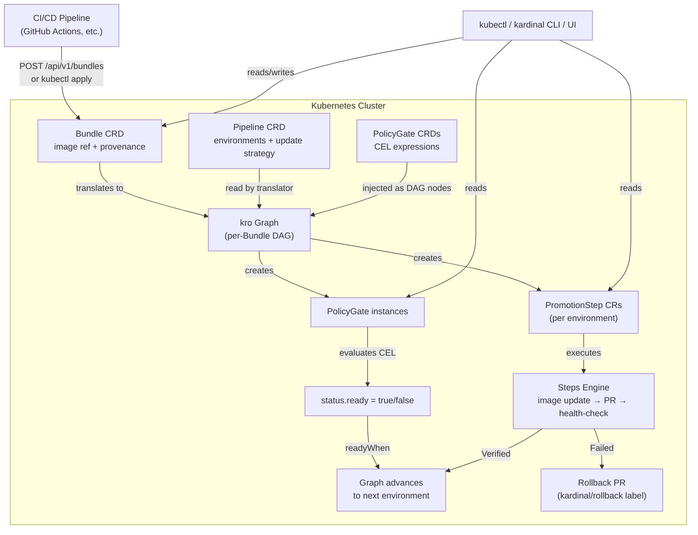
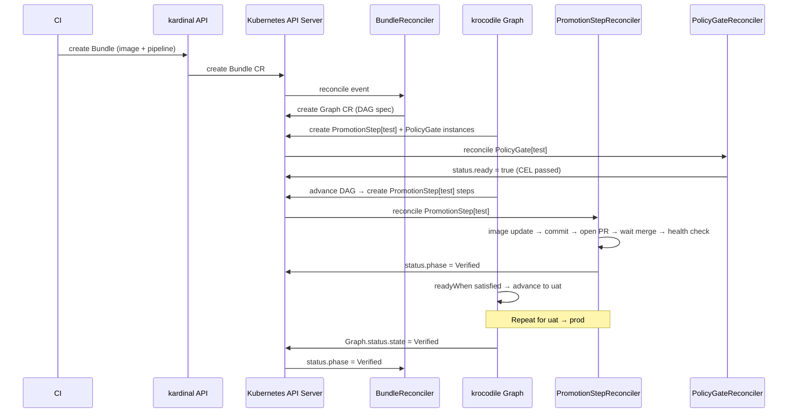

# Architecture

kardinal-promoter is a Kubernetes-native controller. All state lives in etcd as CRDs. The CLI, UI, and webhook API are convenience layers that create and read CRDs — you can operate the entire system with `kubectl`.

---

## System Overview



---

## Core Components

### Controller (`cmd/kardinal-controller`)

The controller manager runs these reconcilers:

| Reconciler | CRD | Responsibility |
|---|---|---|
| `BundleReconciler` | `Bundle` | Calls the translator to build a kro Graph; watches Graph status |
| `PipelineReconciler` | `Pipeline` | Validates pipeline config; computes aggregate pipeline status |
| `PromotionStepReconciler` | `PromotionStep` | Runs the steps engine: git-clone → image update → PR → health check |
| `PolicyGateReconciler` | `PolicyGate` (instances) | Evaluates CEL expression; writes `status.ready` |
| `MetricCheckReconciler` | `MetricCheck` | Queries Prometheus; writes result to status |
| `PRStatusReconciler` | `PRStatus` | Polls SCM for PR merge/close signal; writes `status.merged` |
| `RollbackPolicyReconciler` | `RollbackPolicy` | Evaluates auto-rollback threshold; creates rollback Bundle |
| `ScheduleClockReconciler` | `ScheduleClock` | Writes `status.tick` on a configurable interval for time-based gates |
| `SubscriptionReconciler` | `Subscription` | Polls OCI/Git sources; creates Bundles on new artifacts |

### Translator (`pkg/translator`)

Converts a `Pipeline` CRD + a `Bundle` CRD into a [kro](https://github.com/kubernetes-sigs/kro) `Graph` spec. The Graph encodes the full promotion DAG:

- One node per `PromotionStep` (environment)
- One node per `PolicyGate` instance (injected between environments)
- `readyWhen` expressions wired so the Graph controller advances nodes in dependency order

### kro Graph Controller (`kro-system`)

kardinal-promoter does **not** implement graph coordination itself. It delegates to the
krocodile Graph controller (an experimental fork of [kro](https://github.com/kubernetes-sigs/kro))
which manages the DAG lifecycle:

- Creates owned resources (PromotionStep CRs, PolicyGate CRs) in topological order
- Advances to the next node when `readyWhen` is satisfied
- Stops the DAG on failure, preventing downstream promotions

> **Dependency note**: kardinal-promoter requires krocodile to be installed in the cluster.
> See [Installation](installation.md#install-krocodile) for setup.

### Steps Engine (`pkg/steps`)

The `PromotionStepReconciler` runs a sequence of built-in steps for each environment:

```
kustomize-set-image  →  git-commit  →  open-pr  →  wait-for-merge  →  health-check
```

Built-in step implementations:

| Step | Description |
|---|---|
| `git-clone` | Clones the GitOps repo (and optionally a config source repo) to a temporary work directory |
| `kustomize-set-image` | Runs `kustomize edit set-image` to update the image reference |
| `kustomize-build` | Runs `kustomize build` and writes rendered plain YAML (rendered-manifests pattern) |
| `helm-set-image` | Updates `values.yaml` image tag for Helm-based repos |
| `config-merge` | Cherry-picks or overlays a Git commit into the environment directory (config Bundles) |
| `git-commit` | Commits changes to the environment branch |
| `git-push` | Pushes the branch; idempotent if already pushed |
| `open-pr` | Opens a pull request via the SCM provider with promotion evidence |
| `wait-for-merge` | Polls `PRStatus` until the PR is merged or closed |
| `health-check` | Queries Kubernetes Deployment readiness or ArgoCD/Flux/Rollouts/Flagger sync status |
| `integration-test` | Runs a Kubernetes Job as part of the promotion; waits for completion |
| `custom-step` | Calls a user-defined webhook with the promotion context |

### PolicyGate Evaluator (`pkg/reconciler/policygate`)

Evaluates CEL expressions against the promotion context. Uses the
[kro CEL library](https://github.com/kubernetes-sigs/kro/tree/main/pkg/cel/library),
giving gates access to `json.*`, `maps.*`, `lists.*`, `random.*`, and standard string
extension functions.

See [CEL Context Reference](reference/cel-context.md) for the full variable list.

### SCM Provider (`pkg/scm`)

Abstracts Git hosting operations. Current implementations:

| Provider | Status |
|---|---|
| GitHub | GA |
| GitLab | Beta |
| Forgejo/Gitea | Beta |

### Health Adapters (`pkg/health`)

Checks whether a promotion is healthy after merging:

| Adapter | Status |
|---|---|
| Kubernetes `Deployment` readiness | GA |
| ArgoCD `Application` sync status | GA |
| Argo Rollouts `Rollout` status | Beta |
| Flux `Kustomization` ready status | GA |
| Flagger `Canary` phase | Beta |

---

## Data Flow: Bundle → Verified



---

## How kardinal Relates to ArgoCD and Flux

kardinal-promoter is **GitOps-agnostic**: it does not communicate with ArgoCD or Flux
during promotion. Instead:

1. `PromotionStepReconciler` opens a Git pull request with the updated image reference.
2. A human (or automated process) merges the PR.
3. ArgoCD or Flux detects the Git change and syncs the cluster.
4. kardinal's **health check** then queries ArgoCD or Flux to confirm sync is complete
   before advancing the DAG.

This means kardinal works with any GitOps engine — or even without one (raw Kubernetes deployments).

---

## State Management

All state is stored in Kubernetes CRDs:

| CRD | Purpose |
|---|---|
| `Pipeline` | Defines environments, update strategy, SCM config |
| `Bundle` | Immutable deployment unit; created by CI |
| `PromotionStep` | Per-environment promotion progress; owned by Graph |
| `PolicyGate` | Policy check template (cluster-scoped or namespace-scoped) |
| `PRStatus` | Tracks GitHub/GitLab PR open/merged/closed state |
| `RollbackPolicy` | Auto-rollback configuration for a Pipeline |
| `MetricCheck` | Prometheus query check, created as a DAG node |
| `ScheduleClock` | Writes `status.tick` on a configurable interval; enables time-based policy gates |
| `ChangeWindow` | Cluster-scoped blackout/recurring allow windows for pipeline promotions |
| `Subscription` | Watches OCI registries or Git repos; auto-creates Bundles on new artifacts |

The controller is **stateless**: it can be restarted at any time without data loss. All
state is recovered by re-reading CRDs.

---

## Further Reading

- [Concepts](concepts.md) — Bundles, Pipelines, PolicyGates explained
- [Policy Gates](policy-gates.md) — CEL expression reference
- [CEL Context Reference](reference/cel-context.md) — variables available in gate expressions
- [Installation](installation.md) — how to install kardinal-promoter
