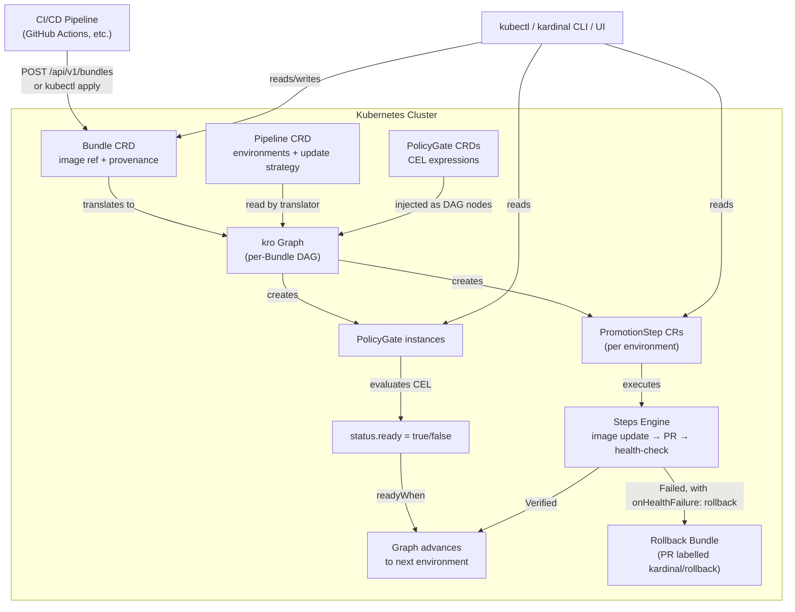
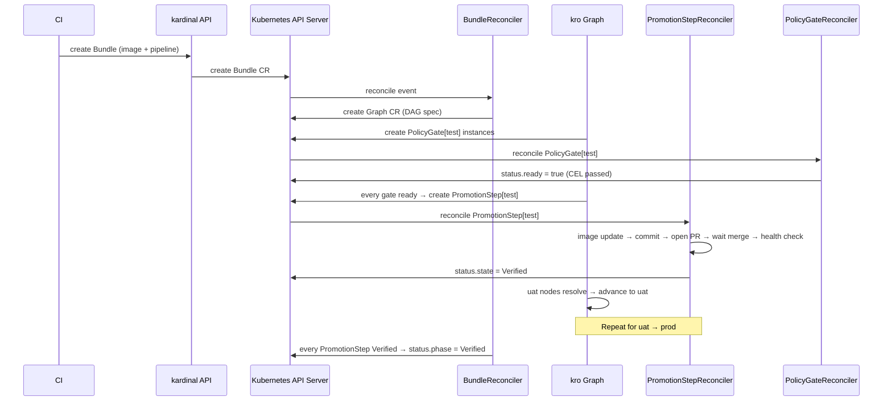

# Architecture

kardinal-promoter is a Kubernetes-native controller. All state lives in etcd as CRDs. The CLI, UI, and webhook API are convenience layers that create and read CRDs — you can operate the entire system with `kubectl`.

---

## System Overview


```mermaid
graph TD
    CI["CI/CD Pipeline<br/>(GitHub Actions, etc.)"] -->|"POST /api/v1/bundles<br/>or kubectl apply"| Bundle

    subgraph "Kubernetes Cluster"
        Bundle["Bundle CRD<br/>image ref + provenance"]
        Pipeline["Pipeline CRD<br/>environments + update strategy"]
        PolicyGate["PolicyGate CRDs<br/>CEL expressions"]

        Bundle -->|"translates to"| Graph["kro Graph<br/>(per-Bundle DAG)"]
        Pipeline -->|"read by translator"| Graph
        PolicyGate -->|"injected as DAG nodes"| Graph

        Graph -->|"creates"| PS["PromotionStep CRs<br/>(per environment)"]
        Graph -->|"creates"| PGI["PolicyGate instances"]

        PS -->|"executes"| Steps["Steps Engine<br/>image update → PR → health-check"]
        PGI -->|"evaluates CEL"| PGR["status.ready = true/false"]

        PGR -->|"readyWhen"| GraphAdv["Graph advances<br/>to next environment"]
        Steps -->|"Verified"| GraphAdv

        Steps -->|"Failed, with onHealthFailure: rollback"| Rollback["Rollback Bundle<br/>(PR labelled kardinal/rollback)"]
    end

    kubectl["kubectl / kardinal CLI / UI"] -->|"reads/writes"| Bundle
    kubectl -->|"reads"| PS
    kubectl -->|"reads"| PGI
```

---

## Core Components

### Controller (`cmd/kardinal-controller`)

The controller manager runs these reconcilers:

| Reconciler | CRD | Responsibility |
|---|---|---|
| `BundleReconciler` | `Bundle` | Calls the translator to build a kro Graph; watches Graph status |
| `PipelineReconciler` | `Pipeline` | Validates pipeline config; computes aggregate pipeline status |
| `PromotionStepReconciler` | `PromotionStep` | Runs the steps engine: git-clone → image update → PR → health check |
| `PolicyGateReconciler` | `PolicyGate` (instances) | Evaluates CEL expression; writes `status.ready` |
| `MetricCheckReconciler` | `MetricCheck` | Queries Prometheus, Datadog, CloudWatch, New Relic or a JSON web API; writes result to status |
| `PRStatusReconciler` | `PRStatus` | Polls SCM for PR merge/close signal; writes `status.merged`, `status.mergeCommitSHA` (or `status.mergeCommitUnavailable` once it stops asking for it) and, for a 401/403/404/410, `status.pollError` |
| `RollbackPolicyReconciler` | `RollbackPolicy` | Reads one Bundle's PromotionSteps in one environment; creates a rollback Bundle at the failure threshold |
| `ScheduleClockReconciler` | `ScheduleClock` | Writes `status.tick` on a configurable interval for time-based gates |
| `ChangeWindowReconciler` | `ChangeWindow` | Writes `status.active` and requeues at the next window boundary |
| `SubscriptionReconciler` | `Subscription` | Polls OCI/Git sources; creates Bundles on new artifacts |
| `NotificationHookReconciler` | `NotificationHook` | Sends webhooks for the events it selects; writes delivery status |
| `HookRunReconciler` | `HookRun` | Runs a Pipeline hook's Job and records its result ([Pipeline hooks](hooks.md)) |
| `ImageVerificationReconciler` | `ImageVerification` | Checks the signatures of a Bundle's images (sigstore) and of a config Bundle's commit; writes the verdict to its status |
| `ScmProviderReconciler` | `ScmProvider`, `ClusterScmProvider` | Checks the provider's settings and Secrets; writes its `Ready` condition ([SCM providers](scm-providers.md)) |
| Audit retention (`pkg/reconciler/auditretention`) | `AuditEvent` | Deletes records past `audit.retention` (off unless enabled) |
| Graph cleanup (`pkg/reconciler/graphcleanup`) | kro `Graph` | Deletes reader RoleBindings no Graph needs any more; lets a Graph in a terminating namespace go once kro can no longer tear it down |

### Translator (`pkg/translator`) and Graph builder (`pkg/graph`)

The translator collects what a Bundle's Graph needs (the Pipeline, its PolicyGate templates, analysis templates, the SCM provider) and the builder in `pkg/graph` turns it into a [kro](https://github.com/kubernetes-sigs/kro) `Graph` spec. The Graph encodes the full promotion DAG:

- One node per `PromotionStep` (environment)
- PolicyGate instances and PRStatuses as `forEach` collection nodes, one item per gate or environment
- `readyWhen` expressions wired so the Graph controller advances nodes in dependency order

[Graph coverage](graph-coverage.md) lists what the Graph decides and what stays in a reconciler.

### kro Graph Controller (`kro-system`)

kardinal-promoter does **not** implement graph coordination itself. It delegates to the
[kro](https://github.com/kubernetes-sigs/kro) Graph controller (`kro.run/v1alpha1` `Graph`,
`GraphKind` feature gate), which manages the DAG lifecycle:

- Creates owned resources (PromotionStep CRs, PolicyGate CRs) in topological order
- Advances to the next node when `readyWhen` is satisfied
- Stops the DAG on failure, preventing downstream promotions

> **Dependency note**: kardinal-promoter requires kro v0.10.0-rc.0+ with the Graph controller enabled.
> See [Installation](installation.md#install-kro) for setup.

### Steps Engine (`pkg/steps`)

The `PromotionStepReconciler` runs a sequence of built-in steps for each environment:

```
git-clone  →  kustomize-set-image  →  git-commit  →  git-push  →  [open-pr  →  wait-for-merge]  →  health-check
```

`open-pr` and `wait-for-merge` run only for `approval: pr-review`. `update.strategy: helm`
uses `helm-set-image` instead of `kustomize-set-image`, config Bundles use `config-merge`,
mixed Bundles run `config-merge` and then the image update step,
and `update.strategy: argocd` runs only `argocd-set-image` and `health-check`
(`pkg/steps/defaults.go`). The sequence is picked when the step leaves Pending and recorded in
`status.steps`; every later reconcile runs the recorded list, not one rebuilt from the live
Pipeline.

Built-in step implementations:

| Step | Description |
|---|---|
| `git-clone` | Clones the GitOps repo into a work directory owned by this PromotionStep (one per namespace, Pipeline, Bundle and environment). For config Bundles it also checks out the `configRef` commit into a separate directory next to it |
| `kustomize-set-image` | Edits the environment's `kustomization.yaml` `images:` list the way `kustomize edit set image` does (no binary needed) |
| `render` | `layout: branch` only, in the controller: asks for the environment's RenderRun and waits for its result (the commit pushed, the DRY commit rendered). The render itself (`git-clone`, the image update, `render-manifests`, `git-commit`, `git-push`) runs in the RenderRun's sandboxed Job, never in the controller ([Rendered Manifests](rendered-manifests.md)) |
| `render-manifests` | `layout: branch` only, in the render Job (`kardinal-render`; it refuses to run anywhere else): renders the environment path of the DRY checkout (kustomize, or Helm for a chart), checks the rendered branch for drift against `.kardinal/rendered.yaml`, and writes one file per object into the rendered branch checkout that `git-commit` commits |
| `helm-set-image` | Updates `values.yaml` image tag for Helm-based repos |
| `argocd-set-image` | Patches the Argo CD Application's image override directly, with no Git commit (`update.strategy: argocd`) |
| `config-merge` | Copies the environment directory of the Bundle's `configRef` commit over the environment directory (config and mixed Bundles). Files deleted in the config commit are not deleted |
| `git-commit` | Commits the working tree changes. When nothing changed it records that, and the later steps skip the push and the PR |
| `git-push` | A sequence with `open-pr` (`pr-review` when the step started): force-pushes `kardinal/<namespace hash>/<bundle>/<env>`, so a re-run after a restart replaces the earlier push. Otherwise (`auto`): pushes the base branch; if it moved, replays the promotion's files onto the new head and pushes again (up to 6 times, no wait), then restarts the sequence from a fresh clone (at most 3 times per reconcile), then retries the step with jittered backoff. While a PR waits for its merge, a moved base branch rebuilds the PR branch on the new head |
| `open-pr` | Opens a pull request via the SCM provider with promotion evidence |
| `wait-for-merge` | Polls `PRStatus` until the PR is merged or closed |
| `health-check` | Queries Kubernetes Deployment readiness or ArgoCD/Flux/Rollouts/Flagger sync status |

There is no custom step engine: every environment runs one of these sequences, and the API
server rejects a Pipeline that sets the deprecated `spec.environments[].steps` or
`promotionTemplate`. For image signature
checks and tests, see [Pipeline Reference: Image signatures and tests](pipeline-reference.md#image-signatures-and-tests).

### PolicyGate Evaluator (`pkg/reconciler/policygate`)

Evaluates CEL expressions against the promotion context, with the `json.*`, `maps.*`,
`lists.*` and `random.*` functions adapted from the
[kro CEL library](https://github.com/kubernetes-sigs/kro/tree/main/pkg/cel/library)
(`pkg/cel/library`) and the standard string extensions.

See [CEL Context Reference](reference/cel-context.md) for the full variable list.

### SCM Provider (`pkg/scm`)

Abstracts Git hosting operations. Current implementations:

| Provider | Status |
|---|---|
| GitHub | GA |
| GitLab | Beta |
| Forgejo, Gitea | Beta |
| Bitbucket Cloud, Azure DevOps | Newer, less tested |

The provider is chosen for the whole controller with `--scm-provider`; see
[SCM Providers](scm-providers.md).

### Health Adapters (`pkg/health`)

Checks whether a promotion is healthy after merging:

| Adapter | Status |
|---|---|
| Kubernetes `Deployment` readiness | GA |
| ArgoCD `Application` sync status | GA |
| Argo Rollouts `Rollout` status | Beta |
| Flux `Kustomization` ready status | GA |
| Flagger `Canary` phase | Beta |

---

## Data Flow: Bundle → Verified


```mermaid
sequenceDiagram
    participant CI
    participant API as kardinal API
    participant K8s as Kubernetes API Server
    participant Bundle as BundleReconciler
    participant kro as kro Graph
    participant PS as PromotionStepReconciler
    participant PG as PolicyGateReconciler

    CI->>API: create Bundle (image + pipeline)
    API->>K8s: create Bundle CR
    K8s->>Bundle: reconcile event
    Bundle->>K8s: create Graph CR (DAG spec)
    kro->>K8s: create PolicyGate[test] instances
    K8s->>PG: reconcile PolicyGate[test]
    PG->>K8s: status.ready = true (CEL passed)
    kro->>K8s: every gate ready → create PromotionStep[test]
    K8s->>PS: reconcile PromotionStep[test]
    PS->>PS: image update → commit → open PR → wait merge → health check
    PS->>K8s: status.state = Verified
    kro->>kro: uat nodes resolve → advance to uat
    Note over kro,PS: Repeat for uat → prod
    Bundle->>K8s: every PromotionStep Verified → status.phase = Verified
```

---

## How kardinal Relates to ArgoCD and Flux

kardinal-promoter is **GitOps-agnostic**: with the `kustomize` and `helm` update strategies
it only writes to Git. Instead of talking to Argo CD or Flux:

1. `PromotionStepReconciler` opens a Git pull request with the updated image reference.
2. A human (or automated process) merges the PR.
3. ArgoCD or Flux detects the Git change and syncs the cluster.
4. kardinal's **health check** then queries ArgoCD or Flux to confirm sync is complete
   before advancing the DAG.

This means kardinal works with any GitOps engine — or even without one (raw Kubernetes deployments).

The exception is `update.strategy: argocd`, which patches the Argo CD `Application`
directly instead of committing to Git. It needs the chart's
`rbac.argocdApplicationsWrite=true` (see [Argo CD native promotion](argocd-native-promotion.md)).

---

## State Management

All state is stored in Kubernetes CRDs:

| CRD | Purpose |
|---|---|
| `Pipeline` | Defines environments, update strategy, SCM config |
| `Bundle` | Immutable deployment unit; created by CI |
| `PromotionStep` | Per-environment promotion progress; owned by Graph |
| `PolicyGate` | Namespaced policy check: templates, and the per-Bundle instances the Graph creates |
| `PRStatus` | Tracks a promotion PR's open, merged or closed state |
| `RollbackPolicy` | Consecutive-failure rollback trigger for one Bundle in one environment (user-created; see [Rollback](rollback.md#autorollback-is-not-implemented)) |
| `MetricCheck` | Metric query (Prometheus, Datadog, CloudWatch, New Relic, web) with a pass/fail threshold, created by the user or, per promotion, by the Graph from a `perPromotion` template; gates read it as `metrics.<name>` |
| `ScheduleClock` | Writes `status.tick` on a configurable interval; enables time-based policy gates |
| `ChangeWindow` | Cluster-scoped blackout/recurring allow windows for pipeline promotions |
| `Subscription` | Watches OCI registries or Git repos; auto-creates Bundles on new artifacts |
| `NotificationHook` | Sends promotion events to a webhook URL |
| `AuditEvent` | Append-only record of promotion events (see [Security](guides/security.md#audit-logging)) |

The controller is **stateless**: it can be restarted at any time without data loss. All
state is recovered by re-reading CRDs.

---

## Further Reading

- [Graph Coverage](graph-coverage.md) — what runs on the kro Graph today and what does not yet
- [Concepts](concepts.md) — Bundles, Pipelines, PolicyGates explained
- [Policy Gates](policy-gates.md) — CEL expression reference
- [CEL Context Reference](reference/cel-context.md) — variables available in gate expressions
- [Installation](installation.md) — how to install kardinal-promoter
