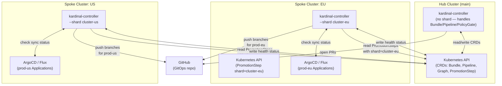

# Distributed Mode

kardinal-promoter supports a distributed deployment model where multiple controller instances
run in separate clusters, each responsible for a named _shard_ of PromotionSteps.

## Architecture



**Key insight**: The Hub cluster holds all CRDs. Shard agents connect to the Hub API server
to read their assigned PromotionSteps and write status updates. Git credentials stay in each
spoke cluster.

## When to Use Distributed Mode

| Scenario | Use distributed? |
|---|---|
| Single cluster, all environments | No — use standalone mode |
| Multi-cluster but same network | Maybe — standalone mode can handle it |
| Strict network isolation between clusters | Yes |
| Git credentials must stay in remote cluster | Yes |
| Large blast radius concern (isolate prod regions) | Yes |
| Different cloud providers per environment | Yes |

In standalone mode (the default), a single controller instance processes all PromotionSteps.
Distributed mode adds operational complexity — only adopt it when the isolation benefit
outweighs the cost.

## Cost and Complexity Comparison

| Aspect | Standalone | Distributed |
|---|---|---|
| Clusters needed | 1 | 1 hub + N spokes |
| Controller instances | 1 | 1 + N |
| Cross-cluster connectivity | Not needed | Hub → spoke API server |
| Credential isolation | Centralized | Per-spoke |
| Observability | Single log stream | Multiple log streams |
| Upgrade complexity | Low | Medium (upgrade hub + all agents) |

## How Sharding Works

Each PromotionStep carries a `kardinal.io/shard` label. When a controller starts with
`--shard <name>`, it processes **only** the steps whose shard label matches. Steps for
other shards are skipped silently.

The Graph controller (which creates PromotionSteps) assigns the shard label based on the
`shard` field in the Pipeline environment spec:

```yaml
apiVersion: kardinal.io/v1alpha1
kind: Pipeline
metadata:
  name: rollouts-demo
spec:
  environments:
    - name: prod-eu
      shard: cluster-eu       # ← this agent handles prod-eu steps
      git:
        url: https://github.com/myorg/gitops
        branch: main
      approval: pr-review
    - name: prod-us
      shard: cluster-us       # ← this agent handles prod-us steps
      git:
        url: https://github.com/myorg/gitops
        branch: main
      approval: pr-review
```

## Deployment

### Control plane (hub cluster)

The main controller runs without a shard flag. It handles Bundle reconciliation, Pipeline
reconciliation, PolicyGate evaluation, and Graph generation. It does NOT process
PromotionStep reconciliation for sharded steps.

```bash
helm install kardinal oci://ghcr.io/pnz1990/charts/kardinal-promoter \
  --namespace kardinal-system \
  --create-namespace \
  --set github.secretRef.name=github-token
```

### Shard agent (per remote cluster)

Each remote cluster runs a controller configured with its shard name:

```bash
helm install kardinal oci://ghcr.io/pnz1990/charts/kardinal-promoter \
  --namespace kardinal-system \
  --create-namespace \
  --set github.secretRef.name=github-token \
  --set controller.shard=cluster-eu \
  --set controller.remoteKubeconfig.secretRef.name=hub-kubeconfig
```

The agent uses the `hub-kubeconfig` secret to connect to the Hub Kubernetes API server
for reading/writing PromotionStep CRs. Its local kubeconfig is used for health checks
against local workloads.

## RBAC for Remote Agent Service Account

The shard agent needs a service account on the Hub cluster with narrow permissions.
Create a `ClusterRole` on the Hub that allows the agent to read/write only PromotionSteps:

```yaml
# Apply on the HUB cluster
apiVersion: rbac.authorization.k8s.io/v1
kind: ClusterRole
metadata:
  name: kardinal-shard-agent
  labels:
    app.kubernetes.io/name: kardinal-promoter
    kardinal.io/component: shard-agent
rules:
  - apiGroups: ["kardinal.io"]
    resources:
      - promotionsteps
    verbs: ["get", "list", "watch", "update", "patch"]
  - apiGroups: ["kardinal.io"]
    resources:
      - promotionsteps/status
    verbs: ["get", "update", "patch"]
  - apiGroups: ["kardinal.io"]
    resources:
      - promotionsteps/finalizers
    verbs: ["update"]
  # Read Pipelines and Bundles (needed to build context)
  - apiGroups: ["kardinal.io"]
    resources:
      - pipelines
      - bundles
    verbs: ["get", "list", "watch"]
  - apiGroups: [""]
    resources:
      - secrets
    verbs: ["get"]  # GitHub token secret only
  - apiGroups: [""]
    resources:
      - events
    verbs: ["create", "patch"]
---
apiVersion: rbac.authorization.k8s.io/v1
kind: ClusterRoleBinding
metadata:
  name: kardinal-shard-agent-cluster-eu
roleRef:
  apiGroup: rbac.authorization.k8s.io
  kind: ClusterRole
  name: kardinal-shard-agent
subjects:
  - kind: ServiceAccount
    name: kardinal-shard-agent
    namespace: kardinal-system
    # The shard agent authenticates using a kubeconfig created from this SA token
```

Generate the kubeconfig for the shard agent:

```bash
# On the HUB cluster: create SA token and kubeconfig
kubectl create serviceaccount kardinal-shard-agent -n kardinal-system
TOKEN=$(kubectl create token kardinal-shard-agent -n kardinal-system --duration=8760h)
kubectl config view --flatten --minify > /tmp/hub-kubeconfig.yaml
# Replace the user credentials in the kubeconfig with the SA token
kubectl create secret generic hub-kubeconfig \
  --namespace kardinal-system \
  --from-file=kubeconfig=/tmp/hub-kubeconfig.yaml \
  --context=spoke-cluster-eu  # apply on the SPOKE cluster
```

## Integration with ArgoCD Hub-Spoke

In a hub-spoke setup, a single ArgoCD installation manages multiple downstream clusters.
kardinal-promoter uses the same hub: the Pipeline controller reads ArgoCD Application
health from the hub cluster, while the shard agent handles Git operations for the
downstream cluster.

See `examples/multi-cluster-fleet/` for a complete example.

## Troubleshooting

### Agent not picking up PromotionSteps

**Symptom**: PromotionSteps for `prod-eu` stay in `Pending` indefinitely.

**Check 1**: Verify the shard label on the step:
```bash
kubectl get promotionstep <step-name> -o jsonpath='{.metadata.labels.kardinal\.io/shard}'
# Expected: cluster-eu
```

**Check 2**: Verify the agent is running with the right shard flag:
```bash
kubectl logs -n kardinal-system deployment/kardinal-shard-agent-eu | grep "shard"
# Expected: {"level":"info","shard":"cluster-eu","msg":"controller started in distributed mode"}
```

**Check 3**: Verify RBAC on the Hub — the agent SA must have `list/watch` on PromotionSteps:
```bash
kubectl auth can-i list promotionsteps --as=system:serviceaccount:kardinal-system:kardinal-shard-agent
# Expected: yes
```

### Agent loses connection to Hub

**Symptom**: Agent logs show `connection refused` or `timeout` errors.

The agent retries with exponential backoff. Steps are not lost — they will be processed
once connectivity is restored. Check:
- Hub API server is reachable from the spoke network
- The kubeconfig secret has a valid token (rotate if expired)
- Any firewall rules allowing the spoke to reach the hub API port (6443)

### Steps processed by wrong shard

**Symptom**: `prod-eu` steps are being processed by the `cluster-us` agent.

This means the step's `kardinal.io/shard` label doesn't match what you expect. Check the
Pipeline environment spec — the `shard` field must exactly match the controller's `--shard` flag.

## Observability

When a controller is running in sharded mode, it logs a startup message:

```
{"level":"info","shard":"cluster-eu","msg":"controller started in distributed mode"}
```

Steps skipped due to shard mismatch are logged at debug level:

```
{"level":"debug","step":"step-prod-eu","step_shard":"cluster-eu","our_shard":"cluster-us","msg":"skipping step — shard mismatch"}
```

Monitor agents independently with the standard [controller metrics](guides/monitoring.md).
Each shard agent exposes its own `:8080/metrics` endpoint.

