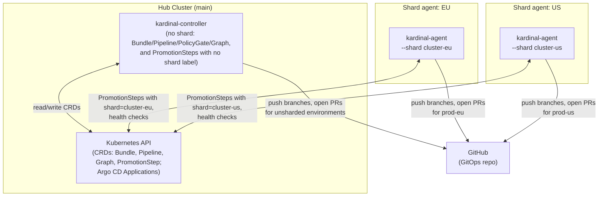

# Distributed Mode

kardinal-promoter can split PromotionStep work across several processes, each responsible
for a named _shard_ of PromotionSteps. The main controller handles Bundles, Pipelines,
PolicyGates and Graphs; a shard agent (`kardinal-agent --shard <name>`) runs only the
PromotionStep reconciler, for the steps labelled with its shard.

!!! warning "Experimental: shard agents are not shipped"
    - The release publishes no `kardinal-agent` image and the chart cannot deploy one. Build
      the binary from `cmd/kardinal-agent` (`make build` writes `bin/kardinal-agent`) and
      package it yourself.
    - The agent uses one Kubernetes client configuration (in-cluster, or `KUBECONFIG`) for
      everything. It reads and writes PromotionSteps on the hub API server, and its health
      checks read the same API server, not the cluster it runs in. For remote environments
      use `health.type: argocd` with an Argo CD in the hub that manages the spoke clusters.
    - Do not use the chart value `controller.shard` to run a shard. It starts
      `kardinal-controller --shard`, which filters only PromotionSteps: it still runs the
      Bundle, Pipeline, PolicyGate and other reconcilers and the UI and webhook servers, and
      it uses the same leader-election Lease (`kardinal-promoter-leader`) as the main
      controller.

## Architecture


```mermaid
graph TB
    subgraph "Hub Cluster (main)"
        Hub["kardinal-controller\n(no shard: Bundle/Pipeline/PolicyGate/Graph,\nand PromotionSteps with no shard label)"]
        K8sHub["Kubernetes API\n(CRDs: Bundle, Pipeline, Graph, PromotionStep;\nArgo CD Applications)"]
        Hub <-->|"read/write CRDs"| K8sHub
    end

    subgraph "Shard agent: EU"
        AgentEU["kardinal-agent\n--shard cluster-eu"]
        AgentEU <-->|"PromotionSteps with shard=cluster-eu,\nhealth checks"| K8sHub
    end

    subgraph "Shard agent: US"
        AgentUS["kardinal-agent\n--shard cluster-us"]
        AgentUS <-->|"PromotionSteps with shard=cluster-us,\nhealth checks"| K8sHub
    end

    GitHub["GitHub\n(GitOps repo)"]
    Hub -->|"push branches, open PRs\nfor unsharded environments"| GitHub
    AgentEU -->|"push branches, open PRs\nfor prod-eu"| GitHub
    AgentUS -->|"push branches, open PRs\nfor prod-us"| GitHub
```

**Key insight**: The hub cluster holds all CRDs. Each shard agent connects to the hub API
server, runs the promotion steps (Git, PR, health check) for its PromotionSteps, and writes
their status there. The agent's own SCM token (`--github-token` or `GITHUB_TOKEN`) stays
wherever the agent runs; a Pipeline `git.secretRef` is read from the hub.

Only the hub controller runs the PRStatus reconciler. It detects merges of the PRs that agents
open, by polling with the hub's SCM token or through the hub's `/webhook/scm` endpoint. So
`approval: pr-review` in a sharded environment needs a hub SCM token that can read the
GitOps repository, or SCM webhooks pointed at the hub.

## When to Use Distributed Mode

| Scenario | Use distributed? |
|---|---|
| Single cluster, all environments | No — use standalone mode |
| Multi-cluster but same network | Maybe — standalone mode can handle it |
| Strict network isolation between clusters | Yes |
| Git credentials must stay in remote cluster | Yes |
| Large blast radius concern (isolate prod regions) | Yes |
| Different cloud providers per environment | Yes |

In standalone mode (the default), a single controller instance processes all PromotionSteps.
Distributed mode adds operational complexity — only adopt it when the isolation benefit
outweighs the cost.

## Cost and Complexity Comparison

| Aspect | Standalone | Distributed |
|---|---|---|
| Clusters needed | 1 | 1 hub + N spokes |
| Controller instances | 1 | 1 + N |
| Cross-cluster connectivity | Not needed | Each agent → hub API server |
| Credential isolation | Centralized | Per agent (its own SCM token) |
| Observability | Single log stream | Multiple log streams |
| Upgrade complexity | Low | Medium (upgrade hub + all agents) |

## How Sharding Works

A PromotionStep of an environment with a `shard` carries the `kardinal.io/shard` label.
A process started with `--shard <name>` watches **only** the steps whose shard label
matches; steps for other shards and steps with no shard label are skipped. The shard name
must be a valid label value (at most 63 characters: letters, digits, `-`, `_` and `.`);
`kardinal-agent` exits at startup if it is not.

The Graph builder copies the `shard` field of the Pipeline environment into the label of
the environment's PromotionStep template, and the kro Graph controller creates the step
with it:

```yaml
apiVersion: kardinal.io/v1alpha1
kind: Pipeline
metadata:
  name: rollouts-demo
spec:
  git:
    url: https://github.com/myorg/gitops   # one repository for every environment
    branch: main
  environments:
    - name: prod-eu
      shard: cluster-eu       # ← the cluster-eu agent handles prod-eu steps
      approval: pr-review
    - name: prod-us
      shard: cluster-us       # ← the cluster-us agent handles prod-us steps
      approval: pr-review
```

## Deployment

### Control plane (hub cluster)

The main controller runs without a shard flag. It handles Bundle reconciliation, Pipeline
reconciliation, PolicyGate evaluation, and Graph generation. It does NOT process
PromotionStep reconciliation for sharded steps.

```bash
helm install kardinal-promoter oci://ghcr.io/pnz1990/charts/kardinal-promoter \
  --namespace kardinal-system \
  --create-namespace \
  --set github.secretRef.name=github-token
```

### Shard agent

Run one `kardinal-agent` per shard, pointed at the hub API server. There is no published
image or chart for it (see the warning at the top of this page), so the command below
assumes you built and packaged `bin/kardinal-agent` yourself and mounted the hub kubeconfig
from the next section at `/etc/kardinal/hub/kubeconfig`:

```bash
KUBECONFIG=/etc/kardinal/hub/kubeconfig \
GITHUB_TOKEN="<token for prod-eu>" \
  kardinal-agent --shard=cluster-eu
```

The agent serves metrics on `:8085` and health probes on `:8086`. Leader election is off by
default; with `--leader-elect` the Lease is named `kardinal-agent-<shard>`.

## RBAC for the Shard Agent on the Hub

The agent needs a ServiceAccount on the hub. Its client caches every kind it reads, so each
read needs `get`, `list` and `watch` across the cluster, Secrets included. The rules below
follow the PromotionStep reconciler's API calls: it patches steps and their status, deletes
orphaned steps, creates and patches PRStatus objects, creates AuditEvents, Events and (for
`onHealthFailure: rollback`) Bundles, and reads Pipelines, PolicyGates, Secrets and the
health objects:

```yaml
# Apply on the HUB cluster
apiVersion: rbac.authorization.k8s.io/v1
kind: ClusterRole
metadata:
  name: kardinal-shard-agent
  labels:
    app.kubernetes.io/name: kardinal-promoter
    kardinal.io/component: shard-agent
rules:
  - apiGroups: ["kardinal.io"]
    resources: ["promotionsteps"]
    verbs: ["get", "list", "watch", "patch", "delete"]
  - apiGroups: ["kardinal.io"]
    resources: ["promotionsteps/status"]
    verbs: ["get", "update", "patch"]
  - apiGroups: ["kardinal.io"]
    resources: ["prstatuses"]
    verbs: ["get", "list", "watch", "create", "patch"]
  - apiGroups: ["kardinal.io"]
    resources: ["pipelines", "policygates"]
    verbs: ["get", "list", "watch"]
  - apiGroups: ["kardinal.io"]
    resources: ["bundles"]
    verbs: ["get", "list", "watch", "create"]
  - apiGroups: ["kardinal.io"]
    resources: ["auditevents"]
    verbs: ["create"]
  # Pipeline git.secretRef Secrets. The cached client lists and watches every
  # Secret it can see, so this is cluster-wide read access to Secrets.
  - apiGroups: [""]
    resources: ["secrets"]
    verbs: ["get", "list", "watch"]
  - apiGroups: [""]
    resources: ["events"]
    verbs: ["create", "patch"]
  # Health adapters: keep only the kinds your environments use.
  - apiGroups: ["apps"]
    resources: ["deployments"]
    verbs: ["get", "list", "watch"]
  # patch is needed only for update.strategy: argocd, which patches the
  # Application's image overrides. Drop it otherwise.
  - apiGroups: ["argoproj.io"]
    resources: ["applications"]
    verbs: ["get", "list", "watch", "patch"]
  - apiGroups: ["argoproj.io"]
    resources: ["rollouts"]
    verbs: ["get", "list", "watch"]
  - apiGroups: ["kustomize.toolkit.fluxcd.io"]
    resources: ["kustomizations"]
    verbs: ["get", "list", "watch"]
  - apiGroups: ["flagger.app"]
    resources: ["canaries"]
    verbs: ["get", "list", "watch"]
---
apiVersion: rbac.authorization.k8s.io/v1
kind: ClusterRoleBinding
metadata:
  name: kardinal-shard-agent-cluster-eu
roleRef:
  apiGroup: rbac.authorization.k8s.io
  kind: ClusterRole
  name: kardinal-shard-agent
subjects:
  - kind: ServiceAccount
    name: kardinal-shard-agent
    namespace: kardinal-system
```

With `--leader-elect`, also grant `leases` (`coordination.k8s.io`) in the namespace the agent
runs in on the hub. If the agent logs `forbidden`, compare the verb and resource in the
message with this list.

Generate a kubeconfig for the agent:

```bash
# On the HUB cluster: create the ServiceAccount and a kubeconfig that uses its token
kubectl create serviceaccount kardinal-shard-agent -n kardinal-system
TOKEN=$(kubectl create token kardinal-shard-agent -n kardinal-system --duration=720h)
kubectl config view --flatten --minify > /tmp/hub-kubeconfig.yaml
kubectl --kubeconfig /tmp/hub-kubeconfig.yaml config set-credentials kardinal-shard-agent --token="$TOKEN"
kubectl --kubeconfig /tmp/hub-kubeconfig.yaml config set-context --current --user=kardinal-shard-agent

# On the SPOKE cluster: store it as a Secret for the agent to mount
kubectl --context spoke-cluster-eu create secret generic hub-kubeconfig \
  --namespace kardinal-system \
  --from-file=kubeconfig=/tmp/hub-kubeconfig.yaml
rm /tmp/hub-kubeconfig.yaml
```

A token from `kubectl create token` is not renewed, and the API server may shorten the
requested duration. Recreate the Secret and restart the agent before the token expires.

## Integration with ArgoCD Hub-Spoke

In a hub-spoke setup, a single ArgoCD installation manages multiple downstream clusters.
kardinal-promoter uses the same hub: with `health.type: argocd`, the health check of a
PromotionStep reads the environment's Application from the hub API server. For a sharded
environment the shard agent runs that check along with the Git and PR steps.

See `examples/multi-cluster-fleet/` for a complete example.

## Troubleshooting

### Agent not picking up PromotionSteps

**Symptom**: PromotionSteps for `prod-eu` stay in `Pending` indefinitely.

**Check 1**: Verify the shard label on the step:
```bash
kubectl get promotionstep <step-name> -o jsonpath='{.metadata.labels.kardinal\.io/shard}'
# Expected: cluster-eu
```

**Check 2**: Verify the agent is running with the right shard flag. Its first log line
names the shard:
```
{"level":"info","shard":"cluster-eu","version":"...","time":"...","message":"[kardinal-agent] starting"}
```

**Check 3**: Verify RBAC on the Hub — the agent SA must have `list/watch` on PromotionSteps:
```bash
kubectl auth can-i list promotionsteps --as=system:serviceaccount:kardinal-system:kardinal-shard-agent
# Expected: yes
```

### Agent loses connection to Hub

**Symptom**: Agent logs show `connection refused` or `timeout` errors.

The agent retries with exponential backoff. Steps are not lost — they will be processed
once connectivity is restored. Check:
- Hub API server is reachable from the spoke network
- The kubeconfig secret has a valid token (rotate if expired)
- Any firewall rules allowing the spoke to reach the hub API port (6443)

### Steps processed by wrong shard

**Symptom**: `prod-eu` steps are being processed by the `cluster-us` agent.

This means the step's `kardinal.io/shard` label doesn't match what you expect. Check the
Pipeline environment spec — the `shard` field must exactly match the controller's `--shard` flag.

## Observability

A shard agent logs its shard at startup (see Check 2 above). `kardinal-controller` started
with `--shard` logs `controller started in distributed mode` with a `shard` field, and
`controller started in standalone mode` without one.

Steps for other shards never reach the reconciler: the watch filters them by label. A step
that is requeued directly is skipped with a debug-level line (`--log-level debug`) that has
`promotionstep`, `step_shard` and `our_shard` fields.

Monitor agents independently with the standard [controller metrics](guides/monitoring.md).
Each shard agent serves its own metrics on `:8085/metrics` (`--metrics-bind-address`); the
main controller serves them on `:8080`.

