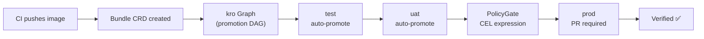

<div align="center" markdown>
  { width="200" }
</div>

# kardinal-promoter

**GitOps promotion pipelines with visible policy gates and PR evidence.**

kardinal-promoter is a Kubernetes-native controller that automates software promotion through environments (test → uat → prod) using a DAG of promotion steps, CEL-based policy gates, and structured PR evidence. All state lives in Kubernetes CRDs — no external database, no lock-in.

<div class="grid cards" markdown>

-   :material-clock-fast:{ .lg .middle } **Get started in 5 minutes**

    ---

    Install kardinal-promoter, apply a Pipeline, create a Bundle, watch it promote.

    [:octicons-arrow-right-24: Quickstart](quickstart.md)

-   :material-shield-check:{ .lg .middle } **Policy gates**

    ---

    Block production deployments on weekends, require soak time, enforce team approvals — all in CEL.

    [:octicons-arrow-right-24: Policy Gates](policy-gates.md)

-   :material-graph:{ .lg .middle } **DAG pipelines**

    ---

    Every promotion is a directed acyclic graph. Fan-out to parallel environments, gate on any condition.

    [:octicons-arrow-right-24: Concepts](concepts.md)

-   :material-source-pull:{ .lg .middle } **PR evidence**

    ---

    Every prod promotion opens a PR with structured evidence: image digest, CI run, gate results, soak time.

    [:octicons-arrow-right-24: PR Evidence](pr-evidence.md)

</div>

## Why kardinal-promoter?

| Feature | kardinal | Kargo | GitOps Promoter |
|---|---|---|---|
| DAG promotion pipelines | ✅ | ❌ linear only | ❌ linear only |
| CEL policy gates with kro library | ✅ | basic | ❌ |
| PR evidence body (structured) | ✅ | ❌ | ✅ basic |
| GitOps-agnostic (ArgoCD + Flux) | ✅ | ArgoCD only | Flux only |
| Auto-rollback on health failure | ✅ | ❌ | ❌ |
| Contiguous healthy soak (`bake.minutes`) | ✅ | ❌ elapsed only | ❌ elapsed only |
| Wave topology for multi-region rollouts | ✅ | ❌ | ❌ |
| Change freeze management (`ChangeWindow` CRD) | ✅ | ❌ | ❌ |
| Pre-deploy gate type | ✅ | ❌ | ❌ |
| DORA metrics built-in | ✅ | ❌ | ❌ |
| Integration test step | ✅ | ❌ | ❌ |
| Emergency override with audit record | ✅ | ❌ | ❌ |
| Cross-stage history in gates | ✅ | ❌ | ❌ |
| Graph-first architecture (krocodile) | ✅ | ❌ | ❌ |

See [detailed comparison →](comparison.md)

## Quick install

```bash
# 1. Install krocodile (Graph controller dependency)
bash hack/install-krocodile.sh

# 2. Create GitHub token secret
kubectl create secret generic github-token \
  --namespace kardinal-system \
  --from-literal=token=$GITHUB_PAT

# 3. Install kardinal-promoter
helm install kardinal-promoter oci://ghcr.io/pnz1990/charts/kardinal-promoter \
  --namespace kardinal-system \
  --create-namespace \
  --set github.secretRef.name=github-token

# 4. Verify
kardinal version
```

See [Installation](installation.md) for full prerequisites and configuration.

## How it works



1. **CI creates a Bundle** with the new image reference and provenance
2. **The controller translates** the Bundle + Pipeline into a kro DAG Graph
3. **The Graph advances** through environments, running steps (image update → PR → health check)
4. **PolicyGates block** or allow promotion based on CEL expressions
5. **A PR is opened** for human review at gated environments, with full evidence

## Key concepts

- **[Bundle](concepts.md#bundle)** — an immutable deployment unit created by CI
- **[Pipeline](concepts.md#pipeline)** — defines environments, update strategy, and SCM config
- **[PolicyGate](concepts.md#policygate)** — a CEL expression that blocks or allows promotion
- **[PromotionStep](concepts.md#promotionstep)** — per-environment promotion progress

