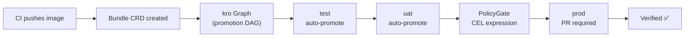

<div align="center" markdown>
  { width="200" }
</div>

# kardinal-promoter

**GitOps promotion pipelines with visible policy gates and PR evidence.**

kardinal-promoter is a Kubernetes-native controller that automates software promotion through environments (test → uat → prod) using a DAG of promotion steps, CEL-based policy gates, and structured PR evidence. All state lives in Kubernetes CRDs — no external database, no lock-in.

<div class="grid cards" markdown>

-   :material-clock-fast:{ .lg .middle } **Get started in 5 minutes**

    ---

    Install kardinal-promoter, apply a Pipeline, create a Bundle, watch it promote.

    [:octicons-arrow-right-24: Quickstart](quickstart.md)

-   :material-shield-check:{ .lg .middle } **Policy gates**

    ---

    Block production deployments on weekends, require soak time, enforce team approvals — all in CEL.

    [:octicons-arrow-right-24: Policy Gates](policy-gates.md)

-   :material-graph:{ .lg .middle } **DAG pipelines**

    ---

    Every promotion is a directed acyclic graph. Fan-out to parallel environments, gate on any condition.

    [:octicons-arrow-right-24: Concepts](concepts.md)

-   :material-source-pull:{ .lg .middle } **PR evidence**

    ---

    An environment with `approval: pr-review` promotes through a PR with structured evidence: image digest, CI run, gate results, upstream health checks.

    [:octicons-arrow-right-24: PR Evidence](pr-evidence.md)

</div>

## Why kardinal-promoter?

All three tools can promote through a DAG of environments. The first rows show where kardinal differs.

| Feature | kardinal | Kargo | GitOps Promoter |
|---|---|---|---|
| CEL policy gates with pipeline context (schedule, upstream soak, metrics, PR review, Bundle metadata) | ✅ | ❌ manual approval and verification | partial: `expr` checks on commits and web responses |
| Soak that resets on a health alarm (`bake`) | ✅ | ❌ elapsed only (`requiredSoakTime`) | ❌ elapsed only (`TimedCommitStatus`) |
| Wave topology for multi-region rollouts | ✅ | ❌ | ❌ |
| Structured PR evidence (provenance, gate results, upstream health) | ✅ | ❌ user-written PR description | basic: commits and a diff link |
| Cluster-wide change freeze (`ChangeWindow` CRD) | ✅ | Enterprise only (promotion windows) | per PromotionStrategy (`ScheduledCommitStatus`) |
| DORA metrics built-in | ✅ | ❌ | ❌ on its roadmap |
| Upstream promotion history in gates | ✅ | ❌ | ❌ |
| Time-limited gate override with a recorded reason | ✅ | ❌ | ❌ |
| Auto-rollback on health failure | ✅ | Enterprise only | ❌ |
| DAG promotion pipelines | ✅ | ✅ Stage DAG | ✅ `dependsOn` |
| GitOps-agnostic (ArgoCD + Flux) | ✅ | ArgoCD (primary) | ✅ |
| Every gate re-checked before a step starts | ✅ | ❌ | ✅ proposed commit statuses |
| Integration test step | No — run tests as an Argo CD PostSync hook with `health.type: argocd`, or gate on a `MetricCheck` ([how](pipeline-reference.md#image-signatures-and-tests)) | ✅ verification can run a Job | ❌ |
| Graph-first architecture (kro Graph) | ✅ | ❌ | ❌ |

See [detailed comparison →](comparison.md)

## Quick install

kardinal-promoter runs on the upstream [kro](https://github.com/kubernetes-sigs/kro) Graph controller (v0.10.0-rc.0, `GraphKind` feature gate). Install kro first, then kardinal.

```bash
# 0. Install kro with the Graph feature gate (from a kardinal-promoter checkout)
bash hack/install-kro.sh

# 1. Create GitHub token secret
kubectl create namespace kardinal-system
kubectl create secret generic github-token \
  --namespace kardinal-system \
  --from-literal=token=$GITHUB_PAT

# 2. Install kardinal-promoter
helm install kardinal-promoter oci://ghcr.io/pnz1990/charts/kardinal-promoter --version 0.9.0 \
  --namespace kardinal-system \
  --create-namespace \
  --set github.secretRef.name=github-token

# 3. Install the CLI
OS=$(uname -s | tr '[:upper:]' '[:lower:]')
ARCH=$(uname -m | sed -e 's/x86_64/amd64/' -e 's/aarch64/arm64/')
curl -Lo kardinal "https://github.com/pnz1990/kardinal-promoter/releases/download/v0.9.0/kardinal-${OS}-${ARCH}"
chmod +x kardinal && sudo mv kardinal /usr/local/bin/

# 4. Verify
kardinal version
```

See [Installation](installation.md) for full prerequisites and configuration.

## How it works


```mermaid
graph LR
    CI["CI pushes image"] --> Bundle["Bundle CRD created"]
    Bundle --> Graph["kro Graph\n(promotion DAG)"]
    Graph --> Test["test\nauto-promote"]
    Test --> UAT["uat\nauto-promote"]
    UAT --> Gate["PolicyGate\nCEL expression"]
    Gate --> Prod["prod\nPR required"]
    Prod --> Done["Verified ✅"]
```

1. **CI creates a Bundle** with the new image reference and provenance
2. **The controller translates** the Bundle + Pipeline into a kro DAG Graph
3. **The Graph advances** through environments, running steps (image update → PR → health check)
4. **PolicyGates block** or allow promotion based on CEL expressions
5. **A PR is opened** for human review at `approval: pr-review` environments, with full evidence

## Key concepts

- **[Bundle](concepts.md#bundle)** — an immutable deployment unit created by CI
- **[Pipeline](concepts.md#pipeline)** — defines environments, update strategy, and SCM config
- **[PolicyGate](concepts.md#policygate)** — a CEL expression that blocks or allows promotion
- **[PromotionStep](concepts.md#promotionstep)** — per-environment promotion progress

## Community

- **GitHub Issues** — [report bugs or request features](https://github.com/pnz1990/kardinal-promoter/issues)
- **Contributing** — read [CONTRIBUTING.md](https://github.com/pnz1990/kardinal-promoter/blob/main/CONTRIBUTING.md) before opening a PR

