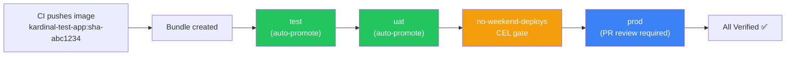

# Quickstart

This guide walks you through setting up your first promotion pipeline with kardinal-promoter. By the end, you will have a working pipeline that promotes the `kardinal-test-app` through test, uat, and prod environments using Git pull requests.

## Fast Start — under 10 minutes

No GitOps repo setup required. Install with `demo.enabled=true` and you get a pre-configured
Pipeline targeting the [`pnz1990/kardinal-demo`](https://github.com/pnz1990/kardinal-demo)
reference repository — ready to promote immediately.

```bash
# 1. Install with demo mode (no GitOps repo setup required)
helm install kardinal-promoter oci://ghcr.io/pnz1990/charts/kardinal-promoter \
  --namespace kardinal-system --create-namespace \
  --set demo.enabled=true \
  --set github.token=$GITHUB_PAT

# 2. Verify the demo Pipeline is running
kardinal get pipelines
# NAME   PHASE     ENVIRONMENTS   AGE
# demo   Waiting   test,uat,prod  10s

# 3. Trigger the first promotion (get the latest test-app SHA from CI)
SHA=$(gh api repos/pnz1990/kardinal-test-app/commits/main --jq '.sha[:7]')
kardinal create bundle demo --image ghcr.io/pnz1990/kardinal-test-app:sha-${SHA}
```

The demo Pipeline uses the reference `kardinal-demo` GitOps repo (already has the correct
Kustomize layout). Test and uat environments promote automatically; prod opens a PR for review.

!!! note "Estimated time: under 10 minutes on a fresh kind cluster"
    Prerequisites: kind cluster, `helm`, `kubectl`, `kardinal`, and a GitHub PAT
    with `repo` write access to `pnz1990/kardinal-demo` (or your fork).

---

## Full Setup (bring your own GitOps repo)

Use the full guide below to set up kardinal-promoter against your own GitOps repository.

## What you will build



- Test and uat promote automatically when the upstream environment is verified.
- Prod requires a human to review and merge a PR.
- The PR includes promotion evidence: what image is being deployed, who built it, and what upstream verification looked like.

!!! info "Test application"
    This quickstart uses [`pnz1990/kardinal-test-app`](https://github.com/pnz1990/kardinal-test-app) and the [`pnz1990/kardinal-demo`](https://github.com/pnz1990/kardinal-demo) GitOps repository. These are the reference applications used in kardinal's own CI validation.

## Prerequisites

- A Kubernetes cluster (kind, Docker Desktop, EKS, GKE, or any distribution)
- [kardinal-promoter installed](#install-kardinal-promoter)
- [Argo CD installed](https://argo-cd.readthedocs.io/en/stable/getting_started/) (or Flux; this guide uses Argo CD)
- A GitHub account with a personal access token (PAT) that has repo write access
- A GitOps repository with Kustomize overlays (see [Set Up Your GitOps Repo](#set-up-your-gitops-repo))

## Install kardinal-promoter

Starting with v0.6.0, kardinal-promoter bundles the krocodile Graph controller directly in the Helm chart. A single `helm install` installs everything — no separate krocodile step needed.

```bash
# Option A: reference an existing Secret (recommended for production)
# The controller watches this Secret and reloads the token automatically on rotation —
# no controller restart needed. See "Credential rotation" in docs/scm-providers.md.
kubectl create secret generic github-token \
  --namespace kardinal-system \
  --from-literal=token=$GITHUB_PAT \
  --dry-run=client -o yaml | kubectl apply -f - --namespace kardinal-system 2>/dev/null || \
kubectl create namespace kardinal-system && \
kubectl create secret generic github-token \
  --namespace kardinal-system \
  --from-literal=token=$GITHUB_PAT

helm install kardinal-promoter oci://ghcr.io/pnz1990/charts/kardinal-promoter \
  --namespace kardinal-system --create-namespace \
  --set github.secretRef.name=github-token

# Option B: pass the token directly (development/testing only)
# Token rotation requires a controller restart when using this option.
helm install kardinal-promoter oci://ghcr.io/pnz1990/charts/kardinal-promoter \
  --namespace kardinal-system --create-namespace \
  --set github.token=$GITHUB_PAT
```

Verify the installation:

```bash
kubectl get pods -n kardinal-system
# NAME                                              READY   STATUS    RESTARTS   AGE
# kardinal-promoter-controller-7f8d9c-xxxxx         1/1     Running   0          30s

kubectl get pods -n kro-system
# NAME                              READY   STATUS    RESTARTS   AGE
# graph-controller-7d4b8f9f5-xk2pq  1/1     Running   0          30s

kardinal version
# CLI:        v0.1.0
# Controller: v0.1.0
```

## Set up your GitOps repo

This quickstart uses [`pnz1990/kardinal-demo`](https://github.com/pnz1990/kardinal-demo) as the GitOps target repository. It already has the required directory structure with environment branches. Fork it or use it directly.

The repository structure:

```
environments/
  test/
    kustomization.yaml      # patches for test
  uat/
    kustomization.yaml      # patches for uat
  prod/
    kustomization.yaml      # patches for prod
```

## Create Argo CD Applications

Create an Argo CD ApplicationSet to manage the three environments:

```bash
cat <<EOF | kubectl apply -f -
apiVersion: argoproj.io/v1alpha1
kind: ApplicationSet
metadata:
  name: kardinal-test-app
  namespace: argocd
spec:
  generators:
    - list:
        elements:
          - env: test
          - env: uat
          - env: prod
  template:
    metadata:
      name: kardinal-test-app-{{env}}
    spec:
      project: default
      source:
        repoURL: https://github.com/pnz1990/kardinal-demo
        targetRevision: main
        path: environments/{{env}}
      destination:
        server: https://kubernetes.default.svc
        namespace: kardinal-test-app-{{env}}
      syncPolicy:
        automated:
          prune: true
          selfHeal: true
        syncOptions:
          - CreateNamespace=true
EOF
```

## Create the Pipeline

First, create a Secret with your GitHub token:

```bash
kubectl create secret generic github-token \
  --from-literal=token=<your-github-pat>
```

You can generate a Pipeline YAML using `kardinal init`:

```bash
kardinal init
# Application name [my-app]: kardinal-test-app
# Namespace [default]: default
# Environments (comma-separated) [test,uat,prod]: test,uat,prod
# Git repository URL: https://github.com/pnz1990/kardinal-demo
# Base branch [main]: main
# Update strategy (kustomize/helm) [kustomize]: kustomize
# Pipeline YAML written to pipeline.yaml
# Apply with: kubectl apply -f pipeline.yaml
```

Then apply it:

```bash
kubectl apply -f pipeline.yaml
```

Or apply `examples/quickstart/pipeline.yaml` directly:

```bash
cat <<EOF | kubectl apply -f -
apiVersion: kardinal.io/v1alpha1
kind: Pipeline
metadata:
  name: kardinal-test-app
spec:
  git:
    url: https://github.com/pnz1990/kardinal-demo
    branch: main
    layout: directory
    provider: github
    secretRef:
      name: github-token
  environments:
    - name: test
      path: environments/test
      update:
        strategy: kustomize
      approval: auto
      health:
        type: argocd
        argocd:
          name: kardinal-test-app-test
    - name: uat
      path: environments/uat
      update:
        strategy: kustomize
      approval: auto
      health:
        type: argocd
        argocd:
          name: kardinal-test-app-uat
    - name: prod
      path: environments/prod
      update:
        strategy: kustomize
      approval: pr-review
      health:
        type: argocd
        argocd:
          name: kardinal-test-app-prod
EOF
```

Verify the Pipeline was created:

```bash
kardinal get pipelines
# PIPELINE              BUNDLE   TEST   UAT   PROD   AGE
# kardinal-test-app     --       --     --    --     10s
```

!!! tip "Troubleshooting: Pipeline not appearing"
    If the pipeline doesn't appear, check that the controller is running:
    ```bash
    kubectl get pods -n kardinal-system
    kubectl logs -n kardinal-system deployment/kardinal-promoter-controller | tail -20
    ```

## Create your first Bundle

In a real setup, your CI pipeline creates Bundles after building and pushing images.
For this quickstart, use the latest `kardinal-test-app` image:

```bash
# Get the latest image SHA from the test app repository
LATEST_SHA=$(gh api repos/pnz1990/kardinal-test-app/commits/main --jq '.sha[:7]')
TEST_IMAGE="ghcr.io/pnz1990/kardinal-test-app:sha-${LATEST_SHA}"
echo "Using image: $TEST_IMAGE"

# Create the Bundle
kardinal create bundle kardinal-test-app --image $TEST_IMAGE
```

Or equivalently with kubectl:

```bash
cat <<EOF | kubectl apply -f -
apiVersion: kardinal.io/v1alpha1
kind: Bundle
metadata:
  name: kardinal-test-app-sha-${LATEST_SHA}
  labels:
    kardinal.io/pipeline: kardinal-test-app
spec:
  type: image
  pipeline: kardinal-test-app
  images:
    - repository: ghcr.io/pnz1990/kardinal-test-app
      tag: "sha-${LATEST_SHA}"
  provenance:
    commitSHA: "${LATEST_SHA}"
    author: "quickstart"
EOF
```

## Watch the promotion

The promotion starts immediately. kardinal-promoter generates a Graph and begins promoting through environments.

```bash
# Watch the pipeline status
kardinal get pipelines
# PIPELINE              BUNDLE          TEST       UAT        PROD           AGE
# kardinal-test-app     sha-abc1234     Verified   Promoting  Waiting        2m

# See individual steps
kardinal get steps kardinal-test-app
# STEP                                     TYPE            STATE           ENV
# kardinal-test-app-sha-abc1234-test       PromotionStep   Verified        test
# kardinal-test-app-sha-abc1234-uat        PromotionStep   HealthChecking  uat
# kardinal-test-app-sha-abc1234-prod       PromotionStep   Pending         prod

# Check why prod hasn't started
kardinal explain kardinal-test-app --env prod
# PROMOTION: kardinal-test-app / prod
#   Bundle: sha-abc1234
#
# RESULT: WAITING
#   Upstream environment "uat" has not been verified yet.
```

!!! tip "Troubleshooting: Test stuck in HealthChecking"
    If the test environment stays in `HealthChecking` for more than a few minutes:
    ```bash
    kubectl get deployment kardinal-test-app -n kardinal-test-app-test
    kubectl describe argoapp kardinal-test-app-test -n argocd
    ```
    Check that ArgoCD has synced the environment and the deployment is healthy.

Once uat is verified, the prod PromotionStep is created. Since prod uses `approval: pr-review`, kardinal-promoter opens a PR:

```bash
kardinal get steps kardinal-test-app
# STEP                                     TYPE            STATE             ENV
# kardinal-test-app-sha-abc1234-test       PromotionStep   Verified          test
# kardinal-test-app-sha-abc1234-uat        PromotionStep   Verified          uat
# kardinal-test-app-sha-abc1234-prod       PromotionStep   WaitingForMerge   prod
```

Go to your GitHub repo ([pnz1990/kardinal-demo](https://github.com/pnz1990/kardinal-demo)). You will see a PR titled:

> **[kardinal] Promote kardinal-test-app sha-abc1234 to prod**

The PR body contains:
- The artifact being promoted (image reference, digest)
- Build provenance (commit SHA, CI run link, author)
- Upstream verification status (test and uat verified timestamps)
- Policy gate compliance (if any gates are configured)

**Merge the PR.** kardinal-promoter detects the merge via webhook, Argo CD syncs the prod Application, and the health adapter verifies it.

```bash
kardinal get pipelines
# PIPELINE              BUNDLE          TEST       UAT        PROD       AGE
# kardinal-test-app     sha-abc1234     Verified   Verified   Verified   8m
```

The promotion is complete.

## Adding policy gates (optional)

To add a no-weekend-deploys gate to prod, create a PolicyGate in the platform-policies namespace:

```bash
kubectl create namespace platform-policies 2>/dev/null

cat <<EOF | kubectl apply -f -
apiVersion: kardinal.io/v1alpha1
kind: PolicyGate
metadata:
  name: no-weekend-deploys
  namespace: platform-policies
  labels:
    kardinal.io/scope: org
    kardinal.io/applies-to: prod
    kardinal.io/type: gate
spec:
  expression: "!schedule.isWeekend"
  message: "Production deployments are blocked on weekends"
  recheckInterval: 5m
EOF
```

The next Bundle promoted to prod will have this gate injected into its Graph. If it is a weekend, the gate blocks the promotion and `kardinal explain` shows why.

## Adding to your CI pipeline

Add a step to your CI pipeline that creates a Bundle after building and pushing your image.

**GitHub Actions example:**

```yaml
- name: Create Bundle
  run: |
    curl -X POST https://kardinal.example.com/api/v1/bundles \
      -H "Authorization: Bearer ${{ secrets.KARDINAL_TOKEN }}" \
      -d '{
        "pipeline": "kardinal-test-app",
        "type": "image",
        "images": [{"repository": "ghcr.io/${{ github.repository }}", "tag": "sha-${{ github.sha }}", "digest": "${{ steps.build.outputs.digest }}"}],
        "provenance": {
          "commitSHA": "${{ github.sha }}",
          "ciRunURL": "${{ github.server_url }}/${{ github.repository }}/actions/runs/${{ github.run_id }}",
          "author": "${{ github.actor }}"
        }
      }'
```

## Next steps

- [Core Concepts](concepts.md): deeper dive into Bundles, Pipelines, PolicyGates, and health adapters
- [Multi-Cluster Fleet Example](../examples/multi-cluster-fleet/): parallel prod regions with Argo Rollouts canary
- [Design Document](design/design-v2.1.md): full technical design
