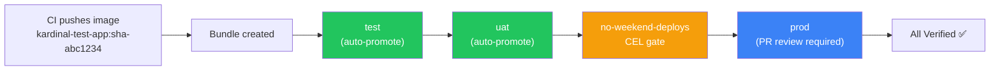

# Quickstart

This guide walks you through setting up your first promotion pipeline with kardinal-promoter. By the end, you will have a working pipeline that promotes the `kardinal-test-app` through test, uat, and prod environments using Git pull requests.

## Fast Start — under 10 minutes

No GitOps repo setup required. Install with `demo.enabled=true` and you get a pre-configured
Pipeline named `demo` in the release namespace. It pushes to the repository in
`demo.git.url`, which defaults to the
[`pnz1990/kardinal-demo`](https://github.com/pnz1990/kardinal-demo) reference repository.
Your token cannot write to that repository, so fork it first and set `demo.git.url` to the fork.

Before you start, the cluster needs:

- kro with the `GraphKind` feature gate (step 1 below).
- Argo CD with one Application per environment: `kardinal-test-app-test`, `kardinal-test-app-uat`
  and `kardinal-test-app-prod` in the `argocd` namespace. The demo Pipeline checks health
  through them. Create them with the ApplicationSet in
  [Create Argo CD Applications](#create-argo-cd-applications).

```bash
# 0. Fork the demo GitOps repo (your GITHUB_PAT needs write access to the fork)
gh repo fork pnz1990/kardinal-demo --clone=false
DEMO_REPO=https://github.com/<your-user>/kardinal-demo

# 1. Install kro (from a kardinal-promoter checkout)
bash hack/install-kro.sh

# 2. Store the token in a Secret, then install with demo mode
kubectl create namespace kardinal-system
kubectl create secret generic github-token \
  --namespace kardinal-system \
  --from-literal=token=$GITHUB_PAT

helm install kardinal-promoter oci://ghcr.io/pnz1990/charts/kardinal-promoter \
  --namespace kardinal-system \
  --set demo.enabled=true \
  --set demo.git.url=$DEMO_REPO \
  --set github.secretRef.name=github-token

# 3. Check the demo Pipeline (it lives in the release namespace)
kardinal get pipelines -n kardinal-system
# PIPELINE   BUNDLE   TEST   UAT   PROD   SUB   AGE
# demo       -        -      -     -      0     10s

# 4. Trigger the first promotion (get the latest test-app SHA from CI)
SHA=$(gh api repos/pnz1990/kardinal-test-app/commits/main --jq '.sha[:7]')
kardinal create bundle demo -n kardinal-system \
  --image ghcr.io/pnz1990/kardinal-test-app:sha-${SHA}
```

The demo Pipeline uses your fork of the `kardinal-demo` GitOps repo (it already has the
correct Kustomize layout). Test and uat environments promote automatically; prod opens a PR for review.

!!! note "Estimated time: under 10 minutes on a fresh kind cluster"
    Prerequisites: kind cluster, `helm`, `kubectl`, `kardinal`, Argo CD, and a GitHub PAT
    with write access to the repository in `demo.git.url`. Point the ApplicationSet
    `repoURL` in [Create Argo CD Applications](#create-argo-cd-applications) at the same fork.

---

## Full Setup (bring your own GitOps repo)

Use the full guide below to set up kardinal-promoter against your own GitOps repository.

## What you will build


```mermaid
graph LR
    CI["CI pushes image<br/>kardinal-test-app:sha-abc1234"] --> Bundle["Bundle created"]
    Bundle --> Test["test\n(auto-promote)"]
    Test --> UAT["uat\n(auto-promote)"]
    UAT --> Gate["no-weekend-deploys\nCEL gate"]
    Gate --> Prod["prod\n(PR review required)"]
    Prod --> Verified["All Verified ✅"]

    style Test fill:#22c55e,color:#fff
    style UAT fill:#22c55e,color:#fff
    style Gate fill:#f59e0b,color:#fff
    style Prod fill:#3b82f6,color:#fff
```

- Test and uat promote automatically when the upstream environment is verified.
- Prod requires a human to review and merge a PR.
- The PR includes promotion evidence: what image is being deployed, who built it, and what upstream verification looked like.

!!! info "Test application"
    This quickstart uses [`pnz1990/kardinal-test-app`](https://github.com/pnz1990/kardinal-test-app) and the [`pnz1990/kardinal-demo`](https://github.com/pnz1990/kardinal-demo) GitOps repository. These are the reference applications used in kardinal's own CI validation.

## Prerequisites

- A Kubernetes cluster (kind, Docker Desktop, EKS, GKE, or any distribution)
- [kardinal-promoter installed](#install-kardinal-promoter)
- [Argo CD installed](https://argo-cd.readthedocs.io/en/stable/getting_started/) (or Flux; this guide uses Argo CD)
- A GitHub account with a personal access token (PAT) that has repo write access
- A GitOps repository with Kustomize overlays (see [Set Up Your GitOps Repo](#set-up-your-gitops-repo))

## Install kardinal-promoter

kardinal-promoter runs on the upstream [kro](https://github.com/kubernetes-sigs/kro) Graph controller. Install kro v0.10.0-rc.0 with the `GraphKind` feature gate first:

```bash
# From a kardinal-promoter checkout
bash hack/install-kro.sh
```

Then install kardinal-promoter:

```bash
# Option A: reference an existing Secret (recommended for production)
# The controller watches this Secret and reloads the token automatically on rotation —
# no controller restart needed. See "Credential rotation" in docs/scm-providers.md.
kubectl create secret generic github-token \
  --namespace kardinal-system \
  --from-literal=token=$GITHUB_PAT \
  --dry-run=client -o yaml | kubectl apply -f - --namespace kardinal-system 2>/dev/null || \
kubectl create namespace kardinal-system && \
kubectl create secret generic github-token \
  --namespace kardinal-system \
  --from-literal=token=$GITHUB_PAT

helm install kardinal-promoter oci://ghcr.io/pnz1990/charts/kardinal-promoter \
  --namespace kardinal-system --create-namespace \
  --set github.secretRef.name=github-token

# Option B: pass the token directly (development/testing only)
# The chart stores it in Secret kardinal-promoter-github-token, but the token
# also stays in the Helm release history.
helm install kardinal-promoter oci://ghcr.io/pnz1990/charts/kardinal-promoter \
  --namespace kardinal-system --create-namespace \
  --set github.token=$GITHUB_PAT
```

Verify the installation:

```bash
kubectl get pods -n kardinal-system
# NAME                                              READY   STATUS    RESTARTS   AGE
# kardinal-promoter-7f8d9c5b6d-x2k9q               1/1     Running   0          30s

kubectl get pods -n kro-system
# NAME                              READY   STATUS    RESTARTS   AGE
# kro-7d4b8f9f5-xk2pq               1/1     Running   0          30s

kardinal version
# CLI:        v0.8.1
# Controller: v0.8.1
# Graph:      kro v0.10.0-rc.0
```

## Set up your GitOps repo

This quickstart uses [`pnz1990/kardinal-demo`](https://github.com/pnz1990/kardinal-demo) as the GitOps target repository. It already has one directory per environment on `main`. Fork it: kardinal pushes to this repository, so the token needs write access to it.

The repository structure:

```
environments/
  test/
    kustomization.yaml      # patches for test
  uat/
    kustomization.yaml      # patches for uat
  prod/
    kustomization.yaml      # patches for prod
```

## Create Argo CD Applications

Create an Argo CD ApplicationSet to manage the three environments:

```bash
cat <<EOF | kubectl apply -f -
apiVersion: argoproj.io/v1alpha1
kind: ApplicationSet
metadata:
  name: kardinal-test-app
  namespace: argocd
spec:
  generators:
    - list:
        elements:
          - env: test
          - env: uat
          - env: prod
  template:
    metadata:
      name: kardinal-test-app-{{env}}
    spec:
      project: default
      source:
        repoURL: https://github.com/pnz1990/kardinal-demo   # your fork
        targetRevision: main
        path: environments/{{env}}
      destination:
        server: https://kubernetes.default.svc
        namespace: kardinal-test-app-{{env}}
      syncPolicy:
        automated:
          prune: true
          selfHeal: true
        syncOptions:
          - CreateNamespace=true
EOF
```

## Create the Pipeline

First, create a Secret with your GitHub token:

```bash
kubectl create secret generic github-token \
  --from-literal=token=<your-github-pat>
```

You can generate a Pipeline YAML using `kardinal init`:

```bash
kardinal init
# Application name [my-app]: kardinal-test-app
# Namespace [default]: default
# Environments (comma-separated) [test,uat,prod]: test,uat,prod
# Git repository URL: https://github.com/pnz1990/kardinal-demo
# Base branch [main]: main
# Update strategy (kustomize/helm) [kustomize]: kustomize
# Pipeline YAML written to pipeline.yaml
# Apply with: kubectl apply -f pipeline.yaml
```

Then apply it:

```bash
kubectl apply -f pipeline.yaml
```

Or apply `examples/quickstart/pipeline.yaml` from a checkout (`kubectl apply -f examples/quickstart/pipeline.yaml`). This is the same Pipeline with the Argo CD Application names spelled out:

```bash
cat <<EOF | kubectl apply -f -
apiVersion: kardinal.io/v1alpha1
kind: Pipeline
metadata:
  name: kardinal-test-app
spec:
  git:
    url: https://github.com/pnz1990/kardinal-demo
    branch: main
    layout: directory
    provider: github
    secretRef:
      name: github-token
  environments:
    - name: test
      path: environments/test
      update:
        strategy: kustomize
      approval: auto
      health:
        type: argocd
        argocd:
          name: kardinal-test-app-test
    - name: uat
      path: environments/uat
      update:
        strategy: kustomize
      approval: auto
      health:
        type: argocd
        argocd:
          name: kardinal-test-app-uat
    - name: prod
      path: environments/prod
      update:
        strategy: kustomize
      approval: pr-review
      health:
        type: argocd
        argocd:
          name: kardinal-test-app-prod
EOF
```

Verify the Pipeline was created:

```bash
kardinal get pipelines
# PIPELINE            BUNDLE   TEST   UAT   PROD   SUB   AGE
# kardinal-test-app   -        -      -     -      0     10s
```

!!! tip "Troubleshooting: Pipeline not appearing"
    If the pipeline doesn't appear, check that the controller is running:
    ```bash
    kubectl get pods -n kardinal-system
    kubectl logs -n kardinal-system deployment/kardinal-promoter | tail -20
    ```

## Create your first Bundle

In a real setup, your CI pipeline creates Bundles after building and pushing images.
For this quickstart, use the latest `kardinal-test-app` image:

```bash
# Get the latest image SHA from the test app repository
LATEST_SHA=$(gh api repos/pnz1990/kardinal-test-app/commits/main --jq '.sha[:7]')
TEST_IMAGE="ghcr.io/pnz1990/kardinal-test-app:sha-${LATEST_SHA}"
echo "Using image: $TEST_IMAGE"

# Create the Bundle
kardinal create bundle kardinal-test-app --image $TEST_IMAGE
```

Or equivalently with kubectl:

```bash
cat <<EOF | kubectl apply -f -
apiVersion: kardinal.io/v1alpha1
kind: Bundle
metadata:
  name: kardinal-test-app-sha-${LATEST_SHA}
  labels:
    kardinal.io/pipeline: kardinal-test-app
spec:
  type: image
  pipeline: kardinal-test-app
  images:
    - repository: ghcr.io/pnz1990/kardinal-test-app
      tag: "sha-${LATEST_SHA}"
  provenance:
    commitSHA: "${LATEST_SHA}"
    author: "quickstart"
EOF
```

## Watch the promotion

The promotion starts immediately. kardinal-promoter generates a Graph and begins promoting through environments.

```bash
# Watch the pipeline status
kardinal get pipelines
# PIPELINE            BUNDLE                    TEST       UAT              PROD   SUB   AGE
# kardinal-test-app   kardinal-test-app-x7k2p   Verified   HealthChecking   -      0     2m

# See the steps of the active Bundle
kardinal get steps kardinal-test-app
# ENVIRONMENT   STEP           STATE        DURATION   MESSAGE
# test          git-clone      Completed    812ms      -
#               ...
# uat           git-clone      Completed    790ms      -
#               ...
#               health-check   InProgress   -          -

# Check why prod hasn't started: prod gets a PromotionStep only after uat is
# Verified (and, with gates, after every gate passes)
kardinal explain kardinal-test-app --env prod
# No promotion for "prod" in pipeline "kardinal-test-app" yet
```

!!! tip "Troubleshooting: Test stuck in HealthChecking"
    If the test environment stays in `HealthChecking` for more than a few minutes:
    ```bash
    kubectl get deployment kardinal-test-app -n kardinal-test-app-test
    kubectl describe application kardinal-test-app-test -n argocd
    ```
    Check that ArgoCD has synced the environment and the deployment is healthy.

Once uat is verified, the prod PromotionStep is created. Since prod uses `approval: pr-review`, kardinal-promoter opens a PR:

```bash
kardinal get steps kardinal-test-app
# ENVIRONMENT   STEP             STATE        DURATION   MESSAGE
# ...
# prod          git-clone        Completed    790ms      -
#               ...
#               wait-for-merge   InProgress   -          -
```

Go to your GitHub repo ([pnz1990/kardinal-demo](https://github.com/pnz1990/kardinal-demo)). You will see a PR titled:

> **[kardinal] Promote kardinal-test-app-x7k2p to prod**

(`kardinal create bundle` names the Bundle `<pipeline>-<random suffix>`.)

The PR body contains:
- The artifact being promoted (image reference, digest)
- Build provenance (commit SHA, CI run link, author)
- Upstream verification status (test and uat verified timestamps)
- Policy gate compliance (if any gates are configured)

**Merge the PR.** kardinal-promoter detects the merge via webhook, Argo CD syncs the prod Application, and the health adapter verifies it.

```bash
kardinal get pipelines
# PIPELINE            BUNDLE                    TEST       UAT        PROD       SUB   AGE
# kardinal-test-app   kardinal-test-app-x7k2p   Verified   Verified   Verified   0     8m
```

The promotion is complete.

## Adding policy gates (optional)

To add a no-weekend-deploys gate to prod, create a PolicyGate in the platform-policies namespace:

```bash
kubectl create namespace platform-policies 2>/dev/null

cat <<EOF | kubectl apply -f -
apiVersion: kardinal.io/v1alpha1
kind: PolicyGate
metadata:
  name: no-weekend-deploys
  namespace: platform-policies
  labels:
    kardinal.io/scope: org
    kardinal.io/applies-to: prod
    kardinal.io/type: gate
spec:
  expression: "!schedule.isWeekend"
  message: "Production deployments are blocked on weekends"
  recheckInterval: 5m
EOF
```

The next Bundle promoted to prod will have this gate injected into its Graph. If it is a weekend, the gate blocks the promotion and `kardinal explain` shows the gate with the controller's latest evaluation:

```bash
kardinal explain kardinal-test-app --env prod
# ENVIRONMENT   TYPE         NAME                 STATE   EXPRESSION            REASON
# prod          PolicyGate   no-weekend-deploys   Block   !schedule.isWeekend   bundle.version=sha-abc1234: !schedule.isWeekend = false
```

## Adding to your CI pipeline

Add a step to your CI pipeline that creates a Bundle after building and pushing your image.

The Bundle API (`POST /api/v1/bundles`) listens on port 8083 of the `kardinal-promoter` Service and is off until you set `bundleAPI.tokenSecretRef.name`. Expose it to CI yourself (for example with an Ingress); `kardinal.example.com` below stands for that address. See [CI integration](ci-integration.md#webhook-token).

**GitHub Actions example:**

```yaml
- name: Create Bundle
  run: |
    curl -X POST https://kardinal.example.com/api/v1/bundles \
      -H "Authorization: Bearer ${{ secrets.KARDINAL_TOKEN }}" \
      -d '{
        "pipeline": "kardinal-test-app",
        "type": "image",
        "images": [{"repository": "ghcr.io/${{ github.repository }}", "tag": "sha-${{ github.sha }}", "digest": "${{ steps.build.outputs.digest }}"}],
        "provenance": {
          "commitSHA": "${{ github.sha }}",
          "ciRunURL": "${{ github.server_url }}/${{ github.repository }}/actions/runs/${{ github.run_id }}",
          "author": "${{ github.actor }}"
        }
      }'
```

## Next steps

- [Core Concepts](concepts.md): deeper dive into Bundles, Pipelines, PolicyGates, and health adapters
- [Multi-Cluster Fleet Example](https://github.com/pnz1990/kardinal-promoter/tree/main/examples/multi-cluster-fleet): parallel prod regions with Argo Rollouts canary
- [Architecture](architecture.md): how the controller works
